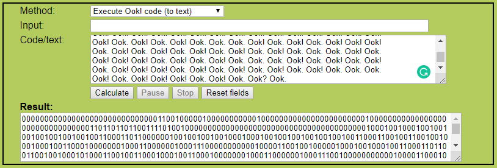

# Your degree doesn't prepare you for this....prove your worth.
A 125 point problem from the 2019 <a href="https://osucyber.club">CyberSecurity Club @ Ohio State</a> CTF


After taking the better part of 4 hours to solve this problem I can assure you that you will be far more sorry than your professors.

Let's get started by following the instructions and downloading "lol.txt" from the server, a text file containing lots and lots of *Ook! Ook.* and *Ook?*
```Ook
Ook. Ook. Ook. Ook. Ook. Ook. Ook. Ook. Ook. Ook. Ook. Ook. Ook! Ook? Ook!
Ook! Ook. Ook? Ook. Ook. Ook. Ook. Ook. Ook. Ook. Ook. Ook. Ook. Ook. Ook.
Ook? Ook. Ook? Ook! Ook. Ook? Ook. Ook. Ook. Ook. Ook. Ook. Ook. Ook. Ook.
...
```
Some of you probably already recognize what this file is, but I did not.

My first few ideas where that the variations of *Ook!* and *Ook.* encoded binary data, but this was quickly dismissed by the realization that this file also contains *Ook?*

Moving on I tried some Googling for *Ook* and discovered what many of you might already know: <a href="https://esolangs.org/wiki/Ook!">Ook!</a> is an esoteric programming language.
If you didn't already know that, you might also not know what an esoteric programming language is. So long story short, they are programming languages that exist because they can; most of them are pretty humorous, but all of them are weird.

Getting into it a little more, Ook isn't just any eso-lang, it's a Brainfuck substitution. Brainfuck is one of the most famous eso-langs and is built on the idea of a continuous array of memory and a pointer to the current cell. That pointer and can be moved to other cells, then the data in that cell incremented, decremented, or printed to the console.
Brainfuck | Meaning
----------|--------
\> | Move the pointer to the right
< | Move the pointer to the left
\+ | Increment the memory cell under the pointer
\- | Decrement the memory cell under the pointer
. | Output the character signified by the cell at the pointer
, | Input a character and store it in the cell at the pointer
[ | Jump past the matching ] if the cell under the pointer is 0
] | Jump back to the matching [


So a Brainfuck substitution just maps those 8 symbols to 8 other symbols, and for Ook! it works like this:
Brainfuck | Ook!
----------|--------
\> | Ook. Ook?
< | Ook? Ook.
\+ | Ook. Ook.
\- | Ook! Ook!
. | Ook! Ook.
, | Ook. Ook!
[ | Ook! Ook?
] | Ook? Ook!

So now that we know what Ook! is we can start looking for how to run it. Thankfully, it's popular enough to have lots of online interpreters out there, the best one I could find is from <a href="https://www.geocachingtoolbox.com/index.php?lang=en&page=brainfuckOok">Geocaching Toolbox.com</a> When we run our code here the output is just a bunch of 1's and 0's, not a flag, but not a dead end either.



After many hours of starting at this binary and trying just about everything I could think of for encoding schemes I still didn't know what this data was and was beginning to think that I was missing something. I converted it to hex, a raw binary, 7-bit ASCII, 8-bit ASCII, 9-bit ASCII, still nothing. Then somewhere along the way I realized that the length of the output is 15447 characters.

15447 isn't divisible by 2, 7, 8, or 9. It's not prime, and not a square. But it is divisible by 3. That doesn't sound very useful until you've been staring at this problem for 3 or 4 hours. Remember how Ook! is a Brainfuck substitution? and remember how Brainfuck has 8 symbols? Well in binary we can encode 8 symbols with 3 bits, so there's a chance that our output is actually a binary encoding of Brainfuck.

Brainfuck | Binary | Base 10
----------|--------|--------
\> | 000 | 0
< | 001 | 1
\+ | 010 | 2
\- | 011 | 3
. | 100 | 4
, | 101 | 5
[ | 110 | 6
] | 111 | 7

If we apply this encoding to our Ook output and represent the symbols in base 10 for the sake of readability it look like this 
```
0 0 0 0 0 0 0 0 0 0 6 2 0 2 0 0 0 2 0 0 0 0 0 0 0 2 0 0 0 0 0 0 0 0 0 0 3 3 3 3 1 7 2 2 0 0 0 0 0 0 0 0 0 0 0 0 0 
4 2 2 1 1 1 1 1 1 1 1 1 4 3 3 0 0 4 4 4 4 4 2 1 1 1 1 1 1 1 1 4 3 1 1 4 4 4 2 1 1 4 2 0 0 4 3 0 0 4 3 4 0 0 0 4 1 
4 4 4 0 4 2 2 1 1 4 3 3 1 4 4 4 2 4 3 1 1 4 2 1 1 4 2 0 0 4 3 0 0 4 3 4 4 0 0 0 4 1 4 2 2 1 1 4 3 3 4 4 4 4 2 4 3 
1 1 4 2 1 1 4 2 0 0 4 3 0 0 4 3 4 4 0 0 0 4 1 1 1 4 4 2 2 1 1 4 3 3 0 0 4 4 4 2 4 3 1 1 4 4 2 1 1 4 2 0 0 4 3 0 0 
4 3 0 0 0 4 1 1 1 4 4 4 0 0 0 4 4 1 4 4 4 4 0 4 1 4 2 2 1 1 4 3 3 1 1 4 4 2 4 3 0 0 4 4 4 2 1 1 4 2 0 0 4 3 0 0 4 
3 1 1 4 0 0 0 4 2 2 1 1 4 3 3 1 4 2 4 3 1 1 4 4 4 2 1 1 4 2 0 0 4 3 0 0 4 3 4 0 0 0 4 1 4 4 2 2 1 1 4 3 3 4 4 4 2 
4 3 1 1 4 2 1 1 4 2 0 0 4 3 0 0 4 3 0 0 4 0 4 2 2 1 1 4 3 3 1 4 4 4 4 2 4 3 1 1 4 2 1 1 4 2 0 0 4 3 0 0 4 3 4 4 4 
0 0 0 4 1 4 4 2 2 1 1 4 3 3 4 2 4 3 1 1 4 4 4 4 2 1 1 4 2 0 0 4 3 0 0 4 3 4 0 0 0 4 1 4 4 4 4 4 4 4 4 4 4 0 4 1 1 
1 4 4 4 4 4 4 0 0 0 4 1 4 2 2 1 1 4 3 3 4 4 2 4 3 1 1 4 4 4 4 4 2 1 1 4 2 0 0 4 3 0 0 4 3 0 0 4 0 4 1 1 1 4 4 4 4 
4 4 4 4 4 4 4 4 4 0 0 0 4 4 4 1 4 4 4 2 2 1 1 4 3 3 4 4 4 4 4 2 4 3 1 1 4 2 1 1 4 2 0 0 4 3 0 0 4 3 0 0 0 4 1 1 1 
4 4 4 4 4 4 0 0 0 4 1 4 4 4 0 4 2 2 1 1 4 3 3 1 4 4 2 4 3 1 1 4 4 4 4 4 2 1 1 4 2 0 0 4 3 0 0 4 3 4 4 4 0 0 0 4 1 
1 1 4 4 2 2 1 1 4 3 3 0 0 4 2 4 3 1 1 4 4 4 2 1 1 4 2 0 0 4 3 0 0 4 3 0 0 0 4 1 4 4 4 4 4 0 4 1 1 1 4 4 4 4 4 4 4 
4 0 0 0 4 1 1 1 4 4 4 4 4 4 4 4 4 4 4 0 0 0 4 1 4 4 4 4 4 4 4 4 4 4 4 4 0 4 1 4 4 2 2 1 1 4 3 3 4 4 4 2 4 3 1 1 4 

...
```

Which in Brainfuck looks like this
```brainfuck
>>>>>>>>>>[+>+>>>+>>>>>>>+>>>>>>>>>>----<]++>>>>>>>>>>>>>.++<<<<<<<<<.-->>.....+<<<<<<<<.-<<...+<<.+>>.->>.-.>>>.<...>.++<<.--<...+.-<<.+<<.+>>.->>.-..>>>.<.++<<.--....+.-<<.+<<.+>>.->>.-..>>>.<<<..++<<.-->>...+.-<<..+<<.+>>.->>.->>>.<<<...>>>..<....>.<.++<<.--<<..+.->>...+<<.+>>.->>.-<<.>>>.++<<.--<.+.-<<...+<<.+>>.->>.-.>>>.<..++<<.--...+.-<<.+<<.+>>.->>.->>.>.++<<.--<....+.-<<.+<<.+>>.->>.-...>>>.<..++<<.--.+.-<<....+<<.+>>.->>.-.>>>.<..........>.<<<......>>>.<.++<<.--..+.-<<.....+<<.+>>.->>.->>.>.<<<.............>>>...<...++<<.--.....+.-<<.+<<.+>>.->>.->>>.<<<......>>>.<...>.++<<.--<..+.-<<.....+<<.+>>.->>.-...>>>.<<<..++<<.-->>.+.-<<...+<<.+>>.->>.->>>.<.....>.<<<........>>>.<<<...........>>>.<............>.<..++<<.--...+.-<<.+<<.+>>.->>.->>..>.<.++<<.--...+.-<<..+<<.+>>.->>.->>.>.<<<.....>>>.<.++<<.--.+.-<<.....+<<.+>>.->>.->>.>.<..++<<.--.+.-<<....+<<.+>>.->>.-.>>>.<..........>.<<<......>>>.<...>.++<<.--<..+.-<<.....+<<.+>>.->>.-...>>>.++<<.--<.+.-<<...+<<.+>>.->>.-.>>>.<<<.>>>.<<<.......>>>.<<<...>>>.<...>.<<<...........>>>.<...........>.<....>.++<<.--<...+.-<<.+<<.+>>.->>.->>....>.<<<.++<<.-->>....+.-<<.+<<.+>>.->>.-...>>>.<.++<<.--...+.-<<..+<<.+>>.->>.->>..>.<.......>.<..++<<.--...
...
```
By the way, the Python script I used to generate the base 10 output is below
```Python
r= ''
with open("ook_out.txt",'r') as ook:    # Read the Ook! output into memory
	r = ook.read()
	
with open("010.txt",'w') as out:        # Iterate over the output 3 characters at a time
	for i in range(0, len(r)-1, 3):
		bf = int(r[i:i+3],2)            # Convert them to base 10
		out.write("{} ".format(bf))
```

When we paste this Brainfuck into our handy-dandy interpreter we will discover that although what we have created in valid code, it is a valid infinite loop. That's not very helpful.

So how did I decide how to encode the binary to Brainfuck, like why did I pick *>* to be *000*? Well, to be honest is was completely arbitrary, no wonder our code doesn't work! Let's try again, but this time let's really think about what symbols should be encoding as what.

My first thought was that the last instruction should be *.* because it prints to the console. Anything done after the last print would serve no purpose if we have no way of reading the result. Next, I knew that every *[* needs a matching *]* so those two characters need to appear the same number of times and the *[* needs to come first. Lastly, I thought about what the code would actually be doing, printing ASCII characters. Since the Brainfuck memory array initializes to be filled with 0's and our first printable characters start at 0x20 we probably need to start with program with lots of *+* to increment the array up to a printable value.

Taking all this in mind and going back to our encoding scheme I settled on the following as being the mostly likely option.
Brainfuck | Binary | Base 10
----------|--------|--------
\> | 010 | 2
< | 011 | 3
\+ | 000 | 0
\- | 001 | 1
. | 100 | 4
, | 101 | 5
[ | 110 | 6
] | 111 | 7

This new encoding gives us the following
```brainfuck
++++++++++[>+>+++>+++++++>++++++++++<<<<-]>>+++++++++++++.>>---------.<<++.....>--------.<--...>--.>++.<++.<.+++.-...
+.>>--.<<-...>.<--.>--.>++.<++.<..+++.-.>>--.<<....>.<--.>--.>++.<++.<..+++.---..>>--.<<++...>.<--..>--.>++.<++.<+++.
---...+++..-....+.-.>>--.<<--..>.<++...>--.>++.<++.<--.+++.>>--.<<-.>.<--...>--.>++.<++.<.+++.-..>>--.<<...>.<--.>--.
>++.<++.<++.+.>>--.<<-....>.<--.>--.>++.<++.<...+++.-..>>--.<<.>.<--....>--.>++.<++.<.+++.-..........+.---......++.-.
>>--.<<..>.<--.....>--.>++.<++.<++.+.---.............+++...-...>>--.<<.....>.<--.>--.>++.<++.<+++.---......+++.-...+.
>>--.<<-..>.<--.....>--.>++.<++.<...+++.---..>>--.<<++.>.<--...>--.>++.<++.<+++.-.....+.---........+++.---...........
+++.-............+.-..>>--.<<...>.<--.>--.>++.<++.<++..+.-.>>--.<<...>.<--..>--.>++.<++.<++.+.---.....+++.-.>>--.<<.>
.<--.....>--.>++.<++.<++.+.-..>>--.<<.>.<--....>--.>++.<++.<.+++.-..........+.---......+++.-...+.>>--.<<-..>.<--.....
>--.>++.<++.<...+++.>>--.<<-.>.<--...>--.>++.<++.<.+++.---.+++.---.......+++.---...+++.-...+.---...........+++.-.....
......+.-....+.>>--.<<-...>.<--.>--.>++.<++.<++....+.---.>>--.<<++....>.<--.>--.>++.<++.<...+++.-.>>--.<<...>.<--..>-
-.>++.<++.<++..+.-.......+.-..>>--.<<...>.<--.>--.>++.<++.<++..+.---.>>--.<<++....>.<--.>--.>++.<++.<...+++.-...>>--.

...
```

Which when run through the online interpreter prints out even more Brainfuck! So I ran that through the interpreter one final time and finally got a flag.

Now that it's over, this problem doesn't really seem too hard, but when you don't know what you're looking at it's HARD AS BALLS. If this writeup seems simple or easy to follow that's because the actual steps to solve this problem are easy, but figuring out what those steps are is not.
Having a Binary with literally no context is almost an impossible challenge. This problem was really an exercise in critical thinking more than anything and I am so happy that I got to solve it!