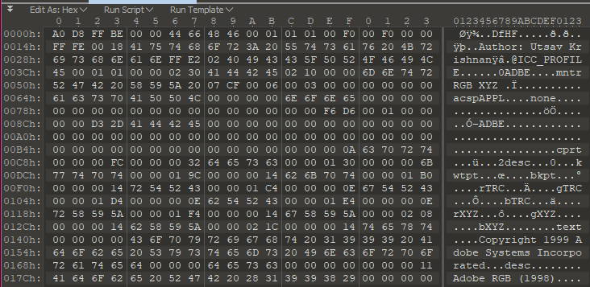
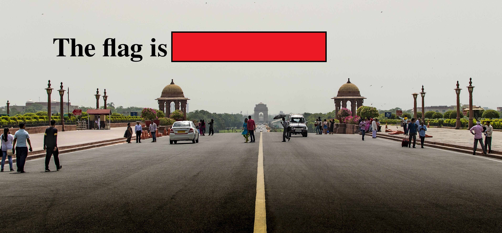

# It's Magic
A 200 point challenge from <a href="https://www.hackerrank.com/codefest-ctf-18">Codefest CTF 2018</a>

`"Repair given corrupted file to get the flag."`

This problem directs the player to download a file appropriately named filename.extension.
Trying to open this file will result in Windows not knowing what program to use and we don't know what the filetype is to change the extension or select the correct program.

I proceeded by opening the file in a hex editor (010) and looking at the magic bytes / header.



In the header the following lines stood out and made me think the file might be a PDF.
```RGB... XYZ... Copyright 1999 Adobe Systems Incorporated... desc... Adobe RGB (1998)```
I then changed the magic bytes to ```25 50 44 46``` for a PDF and the file extension to pdf, but that didn't work.

I tried looking up the old magic bytes on <a href="https://en.wikipedia.org/wiki/List_of_file_signatures">Wikipedia</a> and found it was similar to JPG.
```A0 D8 FF BE``` --> ```FF D8 FF E0 00 10 4A 46 49 46 00 01```

Changing the magic bytes to these values and the file extension to .jpeg produced this beautiful picture of the flag.

